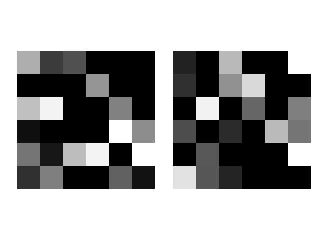

# SylNER: 한국어 음절기반 개체명인식 프로그램
2017국어정보처리경진대회 출품작. [English README](./README.md)

위의 이미지는 "실너"를 SylNER를 통해 이미지화 시킨 결과입니다.

#### Acknowledgement
(https://github.com/neotune/python-korean-handler)
한국어음절을 음소로 분해하는 편리한 함수를 빌려왔습니다.

#### 호환성
* Python 3.5.3 
* TensorFlow 1.3 이상
* Numpy 1.13.1 or 이상
* Matplolib 2.0.2 이상

