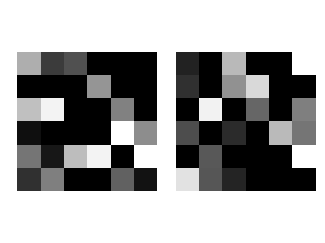

# SylNER: Syllable-based Named Entity Recognition for Korean Language
Submission to 2017 Korean Language Expo. [한국어 README](./README.ko.md)

Above image is a imagified syllables, "실너", which is how to read "SylNER" in Korean.

#### Acknowledgement
(https://github.com/neotune/python-korean-handler)
Here, I could borrow a handy function to decompose syllables into characters.

#### Dependencies
* Python 3.5.3 
* TensorFlow 1.3 or higher
* Numpy 1.13.1 or higher
* Matplolib 2.0.2 or higher
